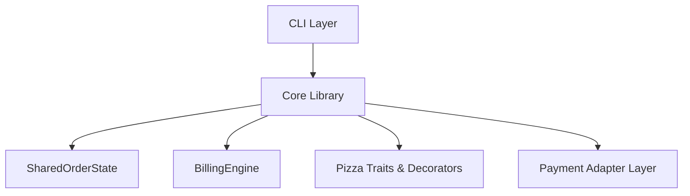
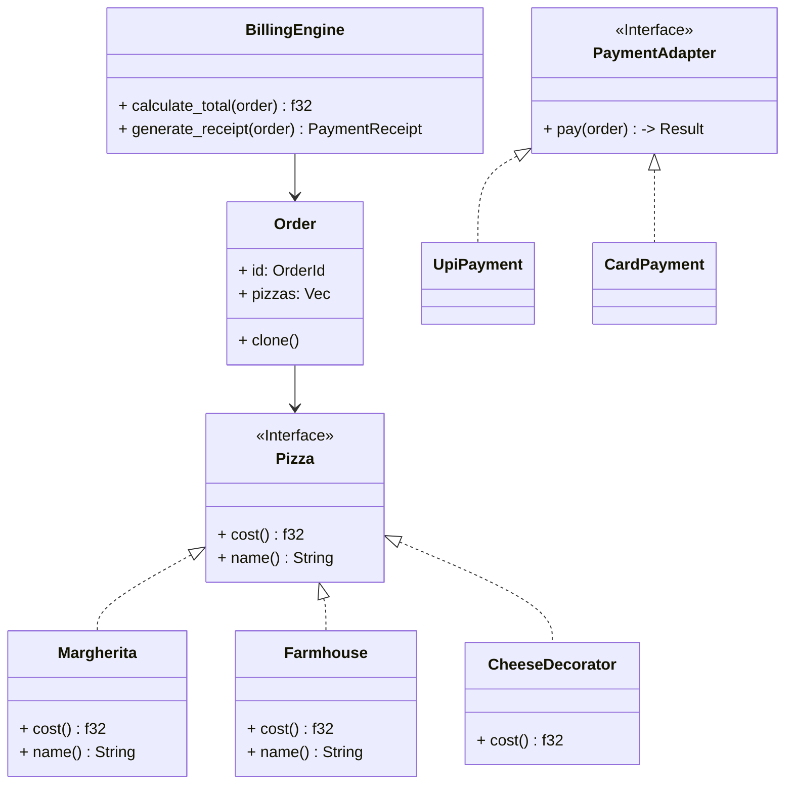
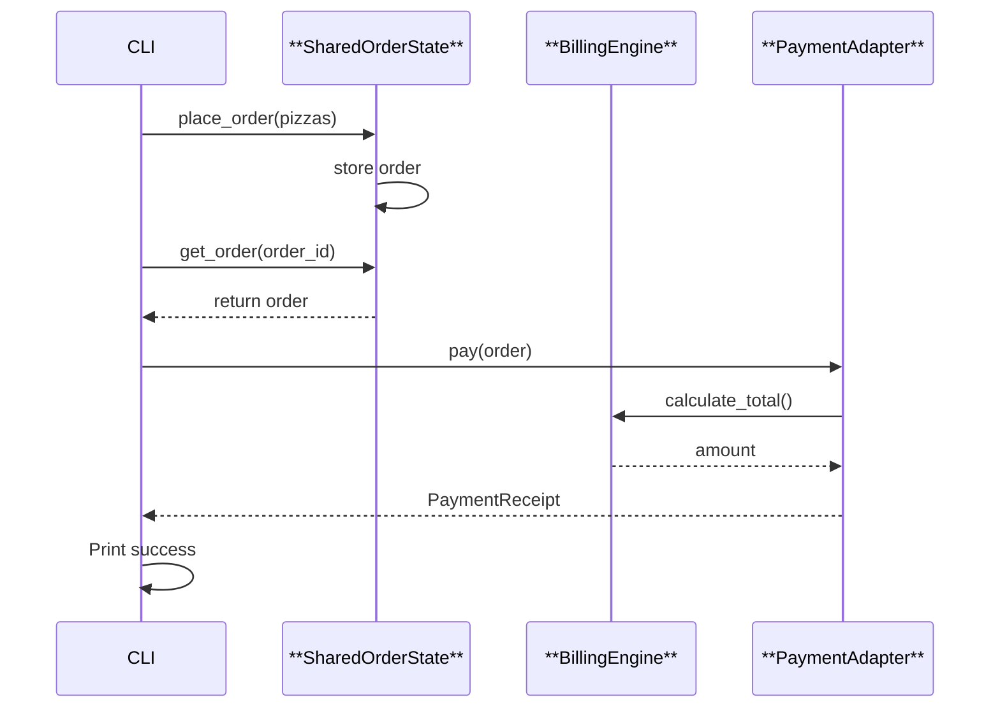

#  FerrisPizza — A Rust-powered Pizza Ordering System

[](LICENSE)

[]()
---
FerrisPizza is a modular Rust-based pizza ordering system featuring a billing engine, extensible pizza customization, order history, and integrated payment processing. The project demonstrates idiomatic Rust application structure along with clean architectural practices — including the Decorator pattern for flexible pizza add-ons and the Adapter pattern for plugging in different payment providers — allowing future extensions without changing core logic

##  Problem Statement

Build a modular, testable, and extensible **pizza ordering system in Rust** that simulates:
- Placing pizza orders
- Viewing order history
- Paying for orders using **payment adapters**
- CLI-based interaction  
- Clean architecture, SOLID principles & design patterns
- 

---

## ✨ Features

| Capability | Description |
|----------|-------------|
 Order Pizza | Choose from multiple pizza types & toppings (Decorator pattern)  
 Order History | View all past orders  
 Multiple Payments | UPI / Card Payment adapters (Strategy + Adapter pattern)  
 Concurrency | Shared order state with threads & channels  
 Modular Architecture | Separate CLI + Core library  
 Unit & Integration Tests | Ensures correctness  
 Clean Rust | Traits, Enums, Modules, Error Handling  

---

##  Architecture Overview

FerrisPizza follows **Clean Modular Architecture**

- `ferrispizza_lib/` → Business logic  
- `ferrispizza_cli/` → CLI UI  
- Patterns Used:
  - **Decorator** → Pizza extras
  - **Strategy/Adapter** → Payments
  - **Observer-like shared state** → Orders via channels

---

##  High-Level Architecture (Mermaid)



---

##  Class Diagram




---

##  Sequence Diagram (Ordering → Payment)



---

## Getting Started

###  **Run the CLI**

```bash
cd ferrispizza_cli
cargo run
```

###  Example Session

```
=== FerrisPizza Menu ===
1) Show Menu
2) Place Order
3) View Order History
4) Pay for Order
5) Exit

Enter choice: 2
Enter pizzas: margherita farmhouse
 Order placed successfully! Order ID: 1

 Enter choice: 4
Enter: pay <order_id> <upi|card>
1 upi
 Payment successful!
Total paid: 350.0
```

---

##  Project Structure

```
ferrispizza/
 ├─ ferrispizza_lib/      # Core logic (Rust library)
 ├─ ferrispizza_cli/      # CLI runner
 └─ Cargo.toml
```

---


## License

MIT © 2025 — FerrisPizza Rust Project

---
